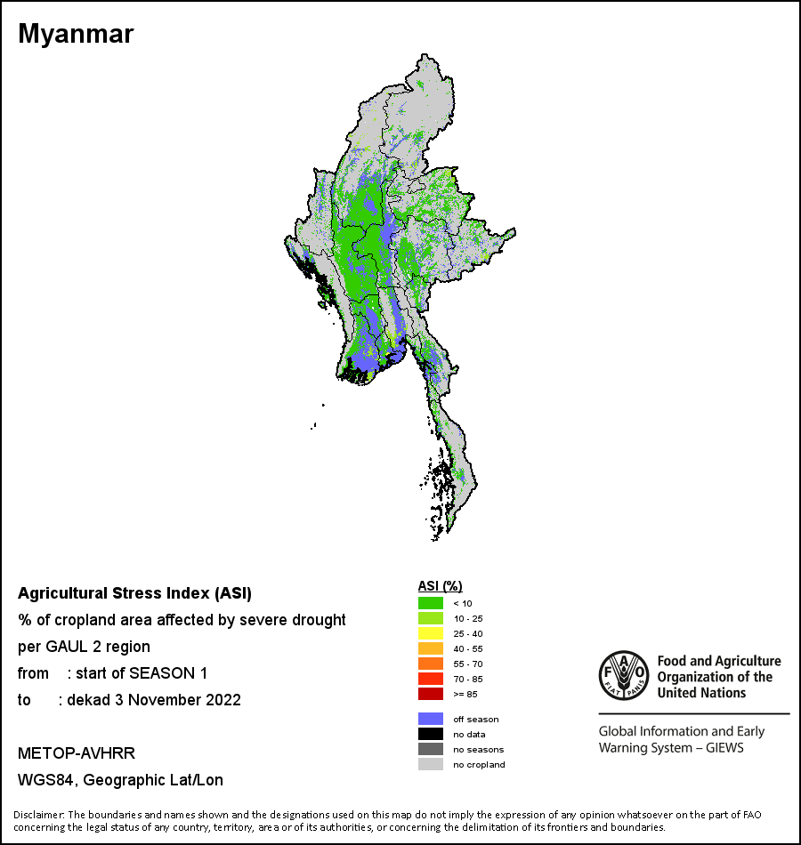
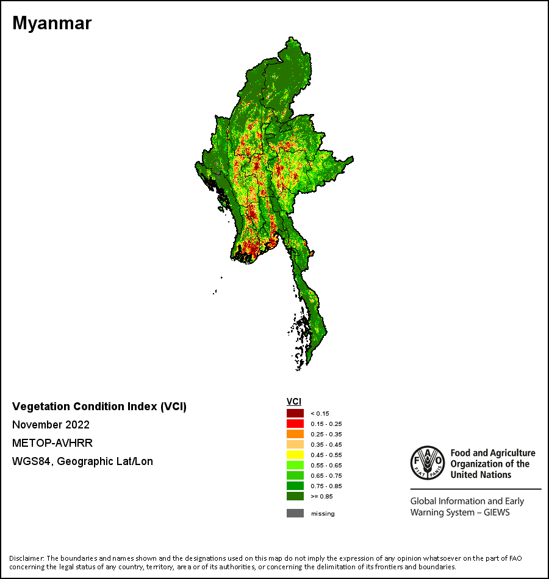
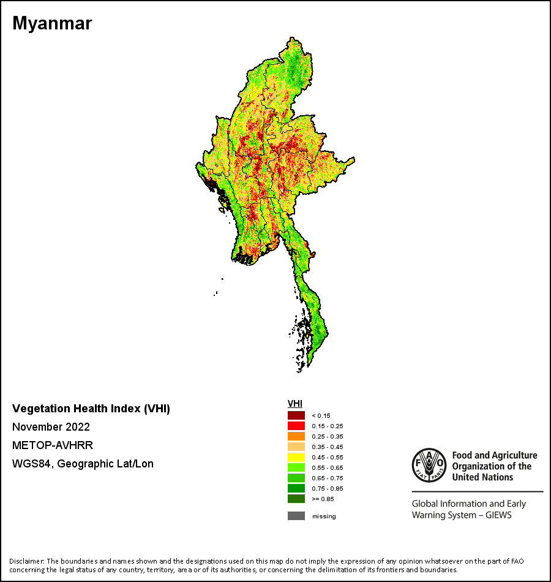

# Background

In this project, I will utilize data collected from a diverse range of international non-governmental organizations (INGOs), non-governmental organizations (NGOs), and social impact organizations engaged in humanitarian and peace-focused activities in Myanmar. The primary focus will be on agricultural data, specifically emphasizing the landscape prior to the occurrence of both the political coup and the COVID-19 pandemic. [(Source: MIMU)](https://themimu.info/5w-maps-and-reports)

In 2015-2016, economic growth in Myanmar eased to 7 percent amid a supply shock from heavy flooding, a slowdown in new investment flows during an election year, and a more challenging external environment including lower commodity prices affecting Myanmar’s main exports. Agriculture growth decelerated to 2 percent in 2015-2016 compared to 5.6 percent the previous year due to the impact of heavy rains between July and September 2015 causing widespread flooding and landslides. The sector contributed less than 10 percent of overall growth. Although the floods were geographically widespread, major agricultural producing areas were particularly badly hit. Damages from the disaster affected storage facilities with stocks of seeds; animals and livestock; aquaculture facilities and fisheries’ ponds; and fishing equipment. Losses were generated from lower crop production, reduced output of meat and eggs, and contraction in fisheries’ production.

These in turn had knock on effects beyond agriculture in food processing, trading, and transportation services. A combination of all this will have negatively affected household incomes and food inscurity .[(Source: World Bank, Myanmar Economic Monitor May 2016)](https://bit.ly/3BGLvJQ)

> The objective of this project is to utilize existing data to develop an engaging and comprehensive interactive report. The primary focus of this dashboard is the agricultural sector, as it seeks to leverage data to explore different (my) perspectives and approaches. The aim is to create visually compelling and informative representations that offer valuable insights and a glimpse into Myanmar's agriculture sector before the occurrence of the coup and the COVID-19 pandemic.


# Project Deliverables
- National Sector, Sub-sectors Description [(See More)](https://bit.ly/41ZTrAu)
- Dashboard: Myanmar Agriculture Landscape (2016) [(Click HERE)](https://bit.ly/45gkCK9)

# Data modelling
For my portfolio project, I'm using secondary data sources. These sources help me save time on data preparation and transformation, as well as some ETL processes. However, I need to unpivot certain tables to optimize my DAX and improve interactivity in the data visualizations. The data sources I've included are:

- Ref: MIMU 5W Overview Dashboard [(See More)](https://themimu.info/5w-overview-dashboard)
- Ref: MIMU 5W Village Tract Dashboard [(See More)](https://themimu.info/5W_Dashboard_by_Village_Tract)
- Ref: MIMU Datasets [(See More)](https://themimu.info/baseline-datasets)


### DAX used in this SAMPLE Dashboard

```
CAGR Agri Project 2014-16 = 
VAR Lastyear = 2016
VAR Firstyear = 2014
VAR No_of_Years = 3

VAR Numerator = CALCULATE(SUM('3W'[2016 - Agriculture]))
VAR Denominator = CALCULATE(SUM('3W'[2014 - Agriculture]))

RETURN
    IF(
        ISBLANK(Numerator) || ISBLANK(Denominator),
        BLANK(),
        POWER(DIVIDE(Numerator, Denominator), 1 / No_of_Years) - 1
    )
```
```
Cultivated Land (%) =
IF (
    HASONEVALUE ( Slicer[Crop] ),
    SWITCH (
        VALUES ( Slicer[Slicer Value] ),
        1, SUM ( 'Agriculture-crops'[Harvested Area of Paddy (acres)] ) / SUM ( 'Satellite - Cultivated Land'[Cultivated area (acre)] ),
        2, SUM ( 'Agriculture-crops'[Harvested Area of Cotton (acres)] ) / SUM ( 'Satellite - Cultivated Land'[Cultivated area (acre)] ),
        3, SUM ( 'Agriculture-crops'[Harvested Area of Green Gram (acres)] ) / SUM ( 'Satellite - Cultivated Land'[Cultivated area (acre)] ),
        4, SUM ( 'Agriculture-crops'[Harvested Area of Ground-nut (acres)] ) / SUM ( 'Satellite - Cultivated Land'[Cultivated area (acre)] ),
        5, SUM ( 'Agriculture-crops'[Harvested Area of Maize (acres)] ) / SUM ( 'Satellite - Cultivated Land'[Cultivated area (acre)] ),
        6, SUM ( 'Agriculture-crops'[Harvested Area of Pigeon Pea (acres)] ) / SUM ( 'Satellite - Cultivated Land'[Cultivated area (acre)] ),
        7, SUM ( 'Agriculture-crops'[Harvested Area of Sesame (acres)] ) / SUM ( 'Satellite - Cultivated Land'[Cultivated area (acre)] ),
        8, SUM ( 'Agriculture-crops'[Harvested Area of Sugar-cane (acres)] ) / SUM ( 'Satellite - Cultivated Land'[Cultivated area (acre)] ),
        9, SUM ( 'Agriculture-crops'[Harvested Area of Sun Flower (acres)] ) / SUM ( 'Satellite - Cultivated Land'[Cultivated area (acre)] ),
        10, SUM ( 'Agriculture-crops'[Harvested Area of Urad Pea (acres)] ) / SUM ( 'Satellite - Cultivated Land'[Cultivated area (acre)] ),
        [Total Harvested Area (Acres)] / SUM ( 'Satellite - Cultivated Land'[Cultivated area (acre)] )
    ),
    [Total Harvested Area (Acres)] / SUM ( 'Satellite - Cultivated Land'[Cultivated area (acre)] )
)

```
```
Harvested Acreage =
VAR SelectedCrop =
    VALUES ( Slicer[Slicer Value] )
RETURN
    IF (
        HASONEVALUE ( Slicer[Crop] ),
        SWITCH (
            TRUE (),
            SelectedCrop = 1, SUM ( 'Agriculture-crops'[Harvested Area of Paddy (acres)] ),
            SelectedCrop = 2, SUM ( 'Agriculture-crops'[Harvested Area of Cotton (acres)] ),
            SelectedCrop = 3, SUM ( 'Agriculture-crops'[Harvested Area of Green Gram (acres)] ),
            SelectedCrop = 4, SUM ( 'Agriculture-crops'[Harvested Area of Ground-nut (acres)] ),
            SelectedCrop = 5, SUM ( 'Agriculture-crops'[Harvested Area of Maize (acres)] ),
            SelectedCrop = 6, SUM ( 'Agriculture-crops'[Harvested Area of Pigeon Pea (acres)] ),
            SelectedCrop = 7, SUM ( 'Agriculture-crops'[Harvested Area of Sesame (acres)] ),
            SelectedCrop = 8, SUM ( 'Agriculture-crops'[Harvested Area of Sugar-cane (acres)] ),
            SelectedCrop = 9, SUM ( 'Agriculture-crops'[Harvested Area of Sun Flower (acres)] ),
            SelectedCrop = 10, SUM ( 'Agriculture-crops'[Harvested Area of Urad Pea (acres)] ),
            [Total Harvested Area (Acres)]
        )
    )
```
# Dashboard [(See More)](https://bit.ly/45gkCK9)

> This tab provides a comprehensive overview of cultivated land, major crop harvests, and production per acre. This measure allows for a more nuanced assessment of crop productivity and efficiency. To facilitate deeper analysis, the tab allows you to disaggregate the data by major crop and state/region. This breakdown enables you to explore variations in agricultural production across different crop types and geographical locations within Myanmar.


> This tab focuses on highlighting the diverse range of agricultural and food security projects and programs implemented by INGOs, NGOs, and social impact organizations in Myanmar. The dashboard and its original data source primarily provide information on the number and scope of these initiatives, without measuring their size and budget. By exploring this tab, you can gain insights into the extensive array of agriculture-related activities aimed at promoting food security in Myanmar. It showcases the collective efforts of various organizations working towards sustainable agriculture, rural development, and enhancing food access and availability. Although the tab does not provide specific details regarding the size and budget of each project or program, it serves as a valuable resource for understanding the breadth and depth of these initiatives. You can gain an overview of the diverse types of interventions being carried out, such as capacity-building programs, agricultural extension services, market development initiatives, and community empowerment projects in original dashboards. [(MIMU 5W Village Tract Dashboard)](https://themimu.info/5W_Dashboard_by_Village_Tract).


> This section of the dashboard encompasses both historical data and simulation results, primarily focused on assessing the impact generated by [AgronomyBot](https://github.com/YemunnSoe/AgronomyBot). The main purpose of this tab is to measure the magnitude of the impact achieved through the utilization of AgronomyBot. The key metrics highlighted in this section include the estimated population of smallholder farmers and the penetration rate of AgronomyBot. The tab highlights the penetration rate of AgronomyBot, indicating the extent to which this technology has been adopted and utilized by smallholder farmers. This metric serves as an indicator of the effectiveness and acceptance of AgronomyBot within the agricultural community. By leveraging this information, stakeholders, policymakers, and researchers can better understand the reach and effectiveness of AgronomyBot in supporting smallholder farmers. It provides a basis for assessing the contribution of this technology towards improving agricultural practices, increasing productivity, and enhancing the livelihoods of smallholder farmers.

# Recent Myanmar Agriculture Landscape (2023)

Since early 2020, Myanmar has faced a series of crises that have had a profound impact on its economy and its people, especially those living in poverty. The country has had to grapple with the COVID-19 pandemic, political and economic unrest following the military coup in February 2021, as well as disruptions in global commodity markets due to the war in Ukraine. These successive crises have taken a significant toll on various sectors, particularly the agri-food industry. Under the successive crises, the agri-food sector has been severely impacted,with huge implications for food and economic security, particularly for the large number of poor people living in rural areas. One the one hand, reduced incomes and higher prices are adversely affecting consumption and food security. On the other hand, rising input prices, especially for fertilizer and fuel, is disrupting agriculture production; many farmers have reduced the use of critical inputs, and in some cases, they are reducing cultivated area. Overall, the agriculture sector contracted by around 10 percent in FY 2021 (World Bank 2021b). It is estimated that paddy area planted in 2021–22 is 7 percent below the average of the past 3 years."[(Read More About THIS)](https://bit.ly/3LUldK4)

In addition to the information provided, I have included FAO Earth Observation satellite image data from May 22 to provide a more comprehensive context of how farming communities are being impacted not only by political turmoil such as coups, the ongoing challenges of COVID-19, and economic downturns but also by the forces of nature. These satellite images offer valuable insights into the current state of these communities.[(FAO Earth Observation)](https://www.fao.org/giews/earthobservation/country/index.jsp?lang=en&code=MMR)


> The Agricultural Stress Index (ASI) is a quick-look indicator that facilitates the early identification of cropped land with a high likelihood of water stress (drought).


> The Vegetation Condition Index (VCI) evaluates the current vegetation health in comparison to the historical trends.


> The Vegetation Health Index (VHI) illustrates the severity of drought based on the vegetation health and the influence of temperature on plant conditions.

To further enhance our understanding, country-level maps and graphs have been generated, showcasing the latest 36-month period of seasonal variations, vegetation patterns, and precipitation indicators. By examining these indicators on both a dekad (10-day) and monthly basis, we gain a more detailed perspective on the changes and trends observed over time. The vegetation indicators are based on data collected by the METOP-AVHRR sensor, which provides high-resolution (1 km) information starting from 2007. For the period between 1984 and 2006, data at a resolution of 16 km from the NOAA-AVHRR dataset are utilized. This comprehensive dataset allows us to analyze vegetation patterns and assess their changes over an extended period. To understand the impact of precipitation on agriculture across Africa, we utilize precipitation estimates sourced from NOAA/FEWSNet for most African countries (excluding Cabo Verde and Mauritius). For the remaining countries, precipitation data is obtained from ECMWF. This data provides crucial information on rainfall patterns and helps to determine their effects on farming communities.

By combining these different datasets and sources, we gain a holistic understanding of the challenges faced by farming communities, encompassing political, economic, and environmental factors. This comprehensive approach enables us to analyze the impact of these natural forces alongside other external factors, ultimately aiding in the formulation of effective strategies and interventions to support these communities in overcoming their challenges.